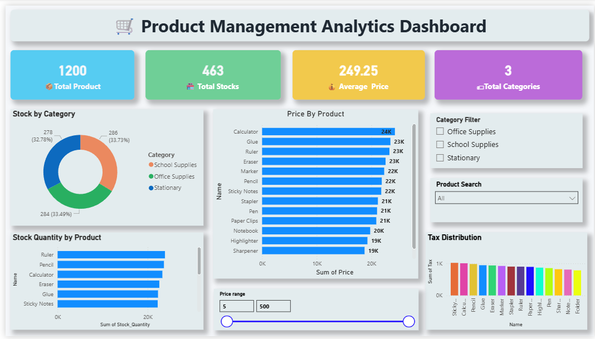

# 📊 Product Management Analytics Dashboard

This project is an interactive Power BI dashboard analyzing product inventory, pricing, and stock distribution.

## 🚀 Dashboard Features
- KPI Cards for total products, stock, price
- Stock distribution by category
- Product price comparison
- Stock quantity by product
- Tax distribution analysis
- Interactive filters (Category, Product Search, Price Range)

## 🛠 Tools Used
- Power BI
- Excel
- Data Visualization

## 📷 Dashboard Preview

## 📊 Key Insights
- Total Products: 1200
- Total Stock: 463
- Average Price: 249.25
- Categories: 3
